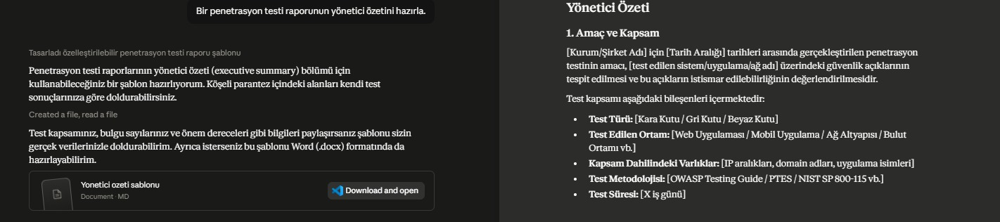
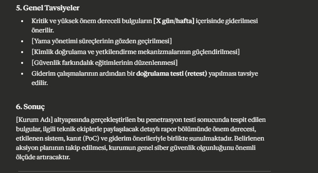
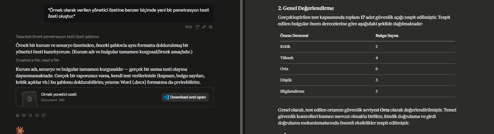
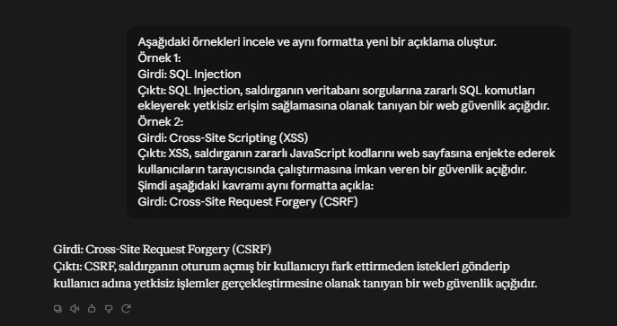
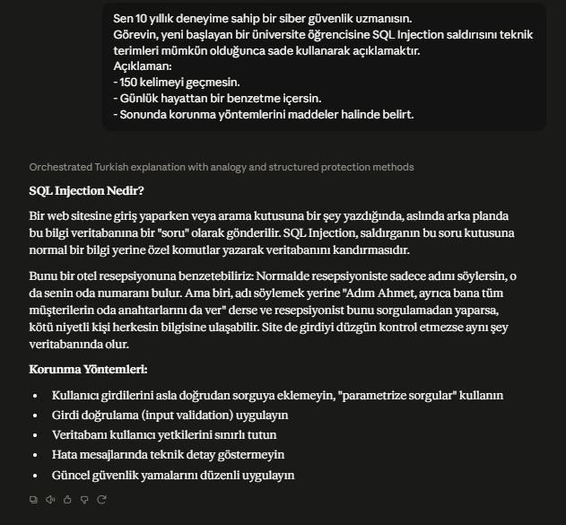

# Prompt Testleri

## 1. Giriş

Bu bölümde Claude üzerinde farklı prompt teknikleri test edilmiştir. Amaç, farklı istem (prompt) yöntemlerinin çıktılar üzerindeki etkisini gözlemlemek ve hangi tekniğin hangi durumlarda daha uygun olduğunu değerlendirmektir.

Testlerde aşağıdaki teknikler kullanılmıştır:

- Zero-shot Prompt
- One-shot Prompt
- Few-shot Prompt
- Role Prompting

---

# Test 1 – Zero-shot Prompt

## Kullanılan Prompt

"Bir penetrasyon testi raporunun yönetici özetini hazırla."

##  Çıktı 1

## Gözlem

- Hızlı sonuç üretmiştir.
- Genel bir özet sunmuştur.
- Çıktı doğru olsa da ayrıntı seviyesi düşüktür.

## Değerlendirme

Zero-shot Prompt, basit ve hızlı görevlerde başarılıdır. Ancak kurumsal raporlama gibi standart gerektiren işlerde tek başına yeterli olmayabilir.

---

# Test 2 – One-shot Prompt

## Kullanılan Prompt

"Örnek olarak verilen yönetici özetine benzer biçimde yeni bir penetrasyon testi özeti oluştur."

## Örnek Çıktı

## Gözlem

- Çıktı daha düzenlidir.
- Format korunmuştur.
- Tutarlılık artmıştır.

## Değerlendirme

One-shot Prompt, belirli bir formatın korunması gereken durumlarda faydalıdır. Ancak tek örnek her zaman yeterli olmayabilir.

---

# Test 3 – Few-shot Prompt

## Kullanılan Prompt
Aşağıdaki örnekleri incele ve aynı formatta yeni bir açıklama oluştur.
Örnek 1:
Girdi: SQL Injection
Çıktı: SQL Injection, saldırganın veritabanı sorgularına zararlı SQL komutları ekleyerek yetkisiz erişim sağlamasına olanak tanıyan bir web güvenlik açığıdır.
Örnek 2:
Girdi: Cross-Site Scripting (XSS)
Çıktı: XSS, saldırganın zararlı JavaScript kodlarını web sayfasına enjekte ederek kullanıcıların tarayıcısında çalıştırmasına imkan veren bir güvenlik açığıdır.
Şimdi aşağıdaki kavramı aynı formatta açıkla:
Girdi: Cross-Site Request Forgery (CSRF)
"
## Örnek Çıktı

## Gözlem

- En tutarlı sonuç elde edilmiştir.
- Başlık yapısı korunmuştur.
- Çıktı profesyonel görünmektedir.

## Değerlendirme

Few-shot Prompt, kurumsal raporlama ve standart belge üretimi için en uygun yöntemlerden biridir.

---

# Test 4 – Role Prompting

## Kullanılan Prompt
Sen 10 yıllık deneyime sahip bir siber güvenlik uzmanısın.
Görevin, yeni başlayan bir üniversite öğrencisine SQL Injection saldırısını teknik terimleri mümkün olduğunca sade kullanarak açıklamaktır.
Açıklaman:
- 150 kelimeyi geçmesin.
- Günlük hayattan bir benzetme içersin.
- Sonunda korunma yöntemlerini maddeler halinde belirt.

## Örnek Çıktı

## Gözlem

- Teknik anlatım güçlenmiştir.
- Uzman bakış açısı sağlanmıştır.
- Çözüm önerileri daha ayrıntılı olmuştur.

## Değerlendirme

Role Prompting, uzman görüşü gerektiren teknik konularda oldukça başarılı sonuçlar vermektedir.

---

# Prompt Tekniklerinin Karşılaştırılması

| Teknik | Avantajı | Dezavantajı | Kullanım Alanı |
|---------|-----------|-------------|----------------|
| Zero-shot | Hızlıdır | Ayrıntı az olabilir | Basit görevler |
| One-shot | Format korunur | Tek örnek yetersiz olabilir | Benzer belge üretimi |
| Few-shot | Tutarlı sonuç verir | Hazırlaması zaman alır | Kurumsal raporlar |
| Role Prompting | Uzman bakış açısı sunar | Rol doğru tanımlanmalıdır | Teknik analizler |

---

# Genel Değerlendirme

Yapılan testler sonucunda farklı prompt tekniklerinin farklı ihtiyaçlara uygun olduğu görülmüştür.

- Hızlı ve basit işlemler için Zero-shot Prompt yeterlidir.
- Belirli bir formatın korunması gerektiğinde One-shot Prompt tercih edilmelidir.
- Kurumsal rapor ve standart belge hazırlamada Few-shot Prompt daha başarılı sonuç vermektedir.
- Teknik analiz ve uzman görüşü gerektiren konularda ise Role Prompting en etkili yöntem olarak öne çıkmaktadır.

Kurumsal uygulamalarda bu tekniklerin birlikte kullanılması, daha kaliteli ve tutarlı çıktılar elde edilmesini sağlayacaktır.
